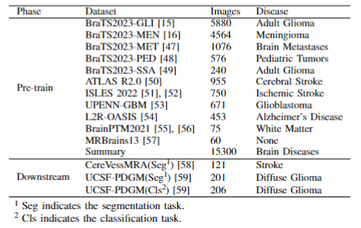

# BDFM

This repository provides a masked image modeling (MIM)-based foundation model of brain disease (BDFM), which was trained on 15,300 brain MRI scans. The training and fine-tuning processes are illustrated below.

## Requirements

```bash
pip install -r requirements.txt
```

## Datasets (BD-15k database)
The details of the pre-training and fine-tuning datasets are shown in the following figure. These datasets are publicly accessible through their respective official websites. Alternatively, we will upload the datasets shortly. You can also download them directly from our repo.

[](Datasets.png)

```bash
datasets/
├── BraTS23_GLI
│   ├── TrainingData
│   └── ValidationData
├── BraTS23_MEN
│   ├── TrainingData
│   └── ValidationData
├── BraTS23_MET
│   ├── TrainingData
│   └── ValidationData
├── BraTS23_PED
│   ├── TrainingData
│   └── ValidationData
├── BraTS23_SSA
│   ├── TrainingData
│   └── ValidationData
├── AtlasR2
│   ├── TrainingData
│   └── ValidationData
├── BrainPTM2021
│   ├── TrainingData
│   └── ValidationData
├── ISLES2022
│   ├── TrainingData
│   └── ValidationData
├── OASIS
│   ├── TrainingData
│   └── ValidationData
├── MRBrains13
│   ├── TrainingData
│   └── ValidationData
└── UPENN-GBM
    ├── TrainingData
    └── ValidationData
```

After downloading the data, generate JSON files:
```bash
get_json.py
```

## Pretrain
(1) To speed up training, you can pre-cache the dataset using “CacheDataset” or “SmartCacheDataset”, which can be modifiedy in `data_utils.py`.


We'll upload all the code as soon as possible.
